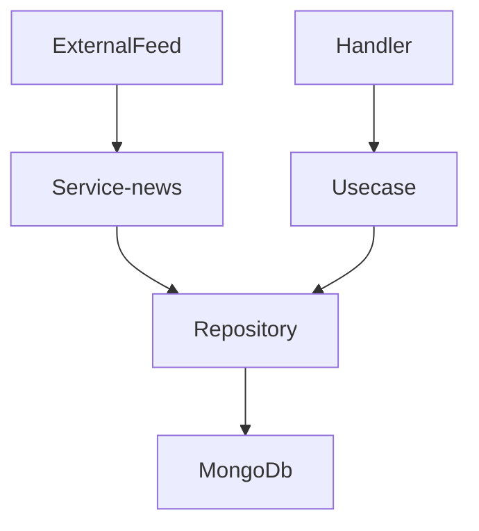

### Legend 

1) Repository - Layer for communication with mongo db
2) Usecase - Layer for implementation business logic
3) Handler - Layer reception http requests 
4) Service-news - Up in separate goroutine for request news from external feeds  

# Related command: 

1) make dev_build - build binary file "news" in ./build/ directory and build docker image   
2) make up - build docker image and up two docker container with docker-compose. One is mongodb container, second is service task-news
3) make down - stop two containers 
4) make clean - remove binary file "news" from ./build/ directory

# Configuration

- TASK_NEWS_CORE_PORT - port for receiving http requests
- TASK_NEWS_CORE_REFRESH_INTERVAL - interval for making requests to external feeds
- TASK_NEWS_CORE_MONGO_ADDRESS - address for connecting to mongo db
- TASK_NEWS_CORE_MONGO_DBNAME - table name in mongo db to storing news (articles)